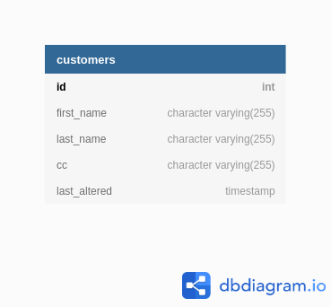

## Streaming CDC data

### Objective:  
Build a streaming data pipeline to capture the CDC data on a PostgreSQL database that ouputs to a S3 location.

### Requirements:
* The pipeline should be paramatrizable for other databases (running PostgreSQL) and other S3 locations.
* Easy to start and stop as needed.
* The solution should account for schema changes, likely requiring a JSON like output.
* deployment should be capable of moving to any cloud provider or even on premise.

### Data:


### POC Explanation:

There are a few options for this task like
  * Kafka Connect
  * Logstash
  * AWS DMS
  * Spark Streaming

Major Benifits of Kafka Connect
* Source and Sink Connector ecosystem is very large, so no code required you can connect just about anything to anything.  
* Scales as needed with little effort   
* Platform neutral  
* For this project the output can be in a JSON, Avro , or Parquet format which can handle schema changes.  
* The Kafka ecosystem has schema registry, which will help significantly with changing schemas.  

output will be in a json:
```
{"id":2,"first_name":"2","last_name":"2","cc":null,"last_altered":1590426878772}
```

### Docker

For this POC I used Docker and a easy to use docker image [fast-data-dev](https://hub.docker.com/r/landoop/fast-data-dev/) that comes with a GUI.
This docker image isn't recomended for a production system.
